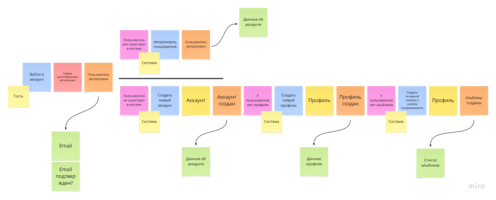
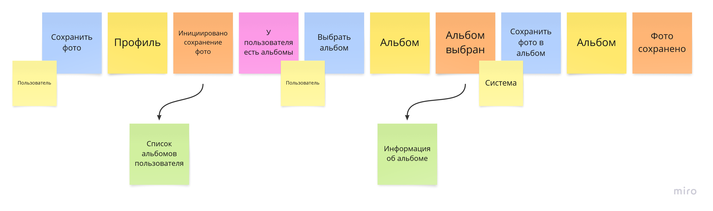
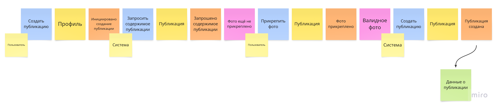
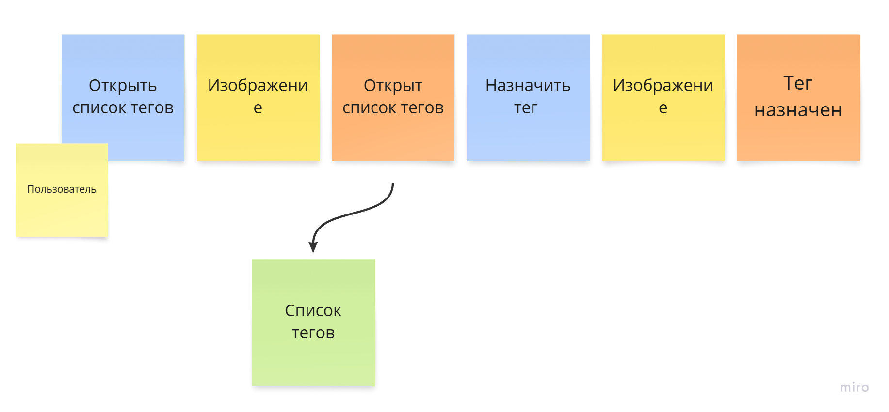
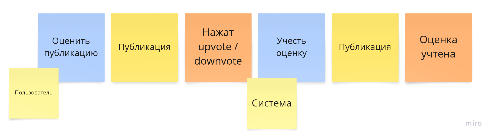

# Контекстная диаграмма

# Бизнес-процессы

1. Авторизация пользователя
    

2. Создание альбома
    

3. Сохранение фото в альбом
    

4. Создание публикации
    

5. Нейропоиск
    

6. Назначение тегов изображению
    

7. Оценивание постов и изображений
    

8. Комментирование постов
    